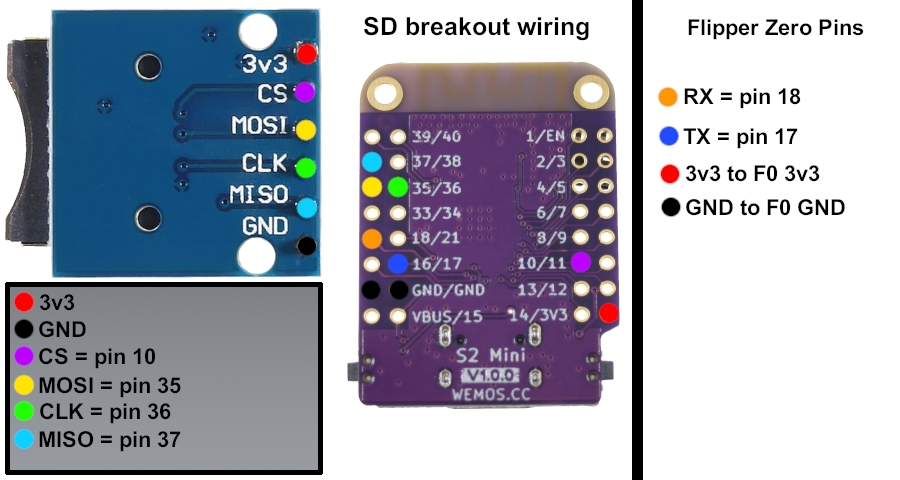
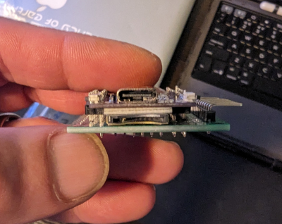
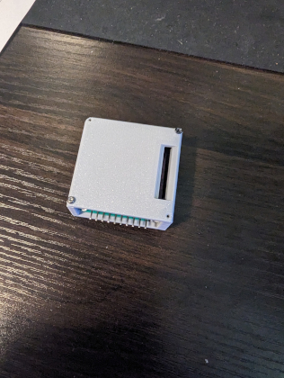
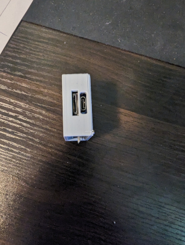
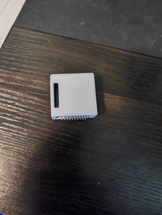

 

  
  

  
---

## 🌟 Updates as of 06/27/24 🌟

- **Marauder files for S2 mini updated to v1.0.0**

- **TX & RX pins defined to correct pins on S2 mini 
(Thanks to <a href=https://www.reddit.com/user/Ant966/>Danny-(Ant966)</a> & <a href=https://www.youtube.com/@SurvivalHacking>SurvivalHacking</a> for providing your diagrams)**

<b>Thought I'd make it easy for those wanting to try out "Wifi Marauder" on the esp32 S2 mini (Purple) module in conjunction with the Flipper Zero. The S2 Mini is a esp32 module without blutooth.
  
This flash tool installs versions 0.13.10 or the newest 1.0.0 of ESPMarauder by <a href=https://github.com/justcallmekoko>JustCallMeKoKo</a>.
The flasher tool also works on <a href="https://www.amazon.com/gp/product/B0C33K27QF/ref=ppx_yo_dt_b_search_asin_title?ie=UTF8&psc=1">K0R41 Mini</a> WiFi Devboard for Flipper Zero on amazon 
</b> 

 

<b>I have followed <a href="https://www.reddit.com/r/flipperzero/comments/16eru8g/comment/kpfxvoi/?utm_source=share&utm_medium=web3x&utm_name=web3xcss&utm_term=1&utm_content=share_button">THIS</a>
tutorial for building and I'm using a pcb prototyping board to build it all on.   I'm doing the sd card breakout version and I'm putting the sd breakout under the wemos S2.   Some filing to 
the sd breakout had be done to allow it to fit under the wemos S2.  
If you read the reddit post by Ant966 at the bottom they have a diagram showing wiring. I have also provided my own diagram as well below.</b> 

## 📁 Added Arduino Sketch 📁
The folder titled "S2Mini_esp32_v1.0.0_marauder" contains the sketch files if you'd like to adjust anything in the sketch before flashing.

---

## ✴️ Marauder Info ✴️
More info about "Wifi Marauder" can be located <a href="https://github.com/justcallmekoko/ESP32Marauder">HERE</a>.

## ⚡ Simple Flash Method ⚡
1. Head over to the <a href="https://atomnft.github.io/ESP32-S2-Mini-Marauder-Build/flash0.html">ESP32 S2 Mini Flash Tool</a> in google chrome to flash the project onto ESP32 S2 mini (Purple module) 

 

## STL files
<b>The files used to build the case for this project are in the repo above or you can grab them from <a href=https://www.printables.com/model/847246-esp32-s2-mini-case>Printables</a>

 

## Wiring Diagram 

 

## Pics of build 

    

## 🗣️ Shoutouts 🗣️

<b>A huge thank you goes to <a href=https://www.reddit.com/user/Ant966/>Danny-(Ant966)</a> over at reddit for helping with the tut! 
 
Also want to thank <a href=https://github.com/Fr4nkFletcher>Fr4nkFletcher</a> for helping with the sd breakout pins. 
 
And of course <a href=https://github.com/justcallmekoko>JustCallMeKoKo</a> for the foundational work on ESP32 Marauder.
 
Thanks to <a href="https://www.reddit.com/user/phalkon13">phalkon13</a> for discovering the flasher tool works on <a href="https://www.amazon.com/gp/product/B0C33K27QF/ref=ppx_yo_dt_b_search_asin_title?ie=UTF8&psc=1">K0R41 Mini</a> WiFi Devboard for Flipper Zero on amazon.</b>

 

